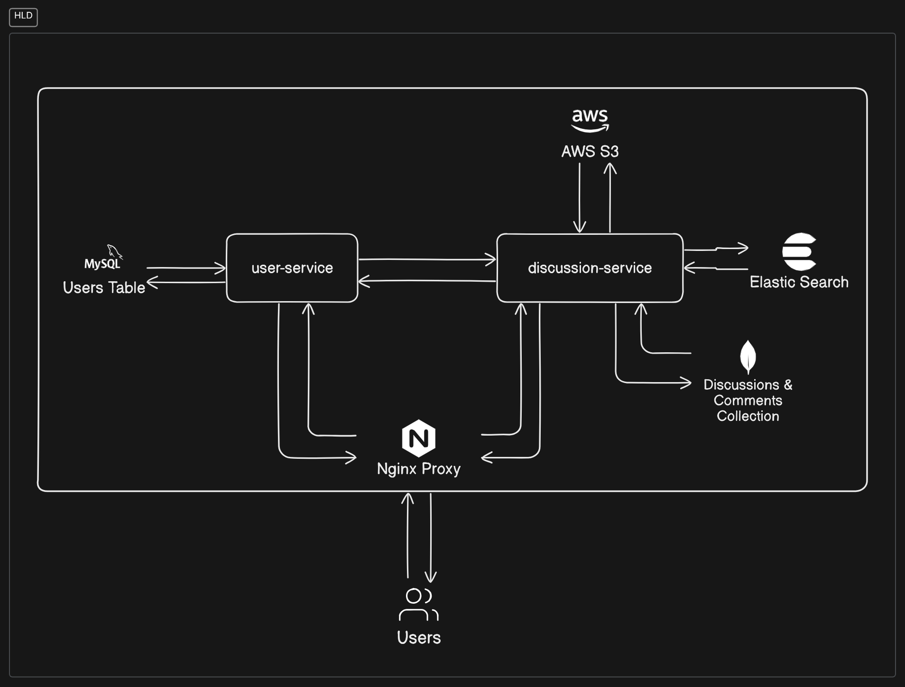

# DiscussHub

## Project Overview

This project is a backend implementation for a social discussions platform, allowing users to create accounts, post discussions, interact with other users' content, and more.

## Features

- User management (signup, login, profile updates)
- Post creation and management
- Commenting and liking system
- User follow functionality
- Post search using hashtags and text
- View count tracking for posts

## Tech Stack

- Backend: Node.js, Express, Mongoose, JWT
- Database: MySQL, MongoDB
- Elastic Search
- Nginx

## Architecture

This project follows a microservice architecture. This is a naive implementation which includes:



### User Service:

This service manages all the requests related to users. The following requests are managed by this service:

- login
- signup
- validate token
- get all users
- search users
- follow user
- unfollow user
- get all followers

This service uses a MySQL DB. It uses `Users` table to store user data and `UserFollows` join table to store the follower following relationship between each user. Node's `jsonwebtoken` package is used to create and manage tokens and `bcrypt` is used to encrpyt passwords before storing them on the table. MySQL was used with this service to ensure ACID properties when a user want to login or signup.

### Discussion Service

This service manages all the discussion, comments and search related queries. The following requests are manged by this service:

- create discussion
- get all discussion
- get discussion by id
- update discussion
- delete discussion
- search by text
- seach by tags
- like a discussion
- unlike a discussion
- view a discussion ( increase view count of a discussion)
- comment on a discussion
- update a comment
- delete a comment
- reply to a comment
- update a reply
- delete a reply
- like a comment
- unlike a comment

This service talks with MongoDB to store `discussions` and `comments`. The images that are uploaded with a discussion are stored in `AWS S3` which is an object store and the imageUrl is saved in the collection. Each Discussion's object maitains a list of commentIds which are the reference to the Comments object. The Comments inturn have a replies list which are also comments. Users can like or unlike a discussion or a comment. The `view api` is a simple get api which then atomically increases the discussion's view count. Idea was to be used with a `Intersection Observer` on the UI which would call this api whenever the ratio is met.

### Hosting Details

Both the service i.e. user-service and discussion-service are hosted on a ec2 machine in thier own docker containers. Nginx is being used a proxy to foward the requests from port 80 of the ec2 machine to the respective containers based on the api path. Another EC2 machine is being used for a self hosted MySQL server used by ther user-service. The discussion-service is using MongoDB cluster on Mongo Atlas and Elastic Search on the Elastic Cloud with AWS S3 for images.

Will try to implement a k8s cluster on the ec2 hosts and use kustomize to manage the deployments if time permits.

### DB Schema


## Getting Started

1. Clone the repository `git clone https://github.com/aritC/DiscussHub.git`

2. `cd services/user-service` and `npm i` to install all relevant dependencies.

3. you will need to create a .env file with the below in user-service dir which will be used by the service.

```
DB_HOST=<mysql hostname>
DB_PORT=<mysql db port>
DB_NAME=<mysql db name>
DB_USER=<mysql db user>
DB_PASS=<mysql db pass>
PORT=<service port>
JWT_SECRET=<jwt secret>
```

4. `npm run dev` to run in dev mode or `npm start` to run this service in production. Alternatively you can build the image using the dockerfile and run using docker as well. Remember to pass the .env to the docker instance using `--env-file <path\to\env\file>`

5. Now `cd ../services/discussion-service` and `npm i` to install all relevant dependencies.

6. you will need to create a .env file with the below in discussion-service dir which will be used by the service.

```
MONGODB_URI=<mongodb cluster uri>
AWS_ACCESS_KEY_ID=<aws access key>
AWS_SECRET_ACCESS_KEY=<aws secret key>
AWS_REGION=<aws region>
S3_BUCKET_NAME=<s3 bucket name>
ES_ENDPOINT=<elastic search endpint>
ES_API_KEY=<elastic search api key>
USER_SERVICE_URL=<url for user-service>
PORT=<service port>
```

7. `npm run dev` to run in dev mode or `npm start` to run this service in production. Alternatively you can build the image using the dockerfile and run using docker as well. Remember to pass the .env to the docker instance using `--env-file <path\to\env\file>`

8. The services should be up and running.
